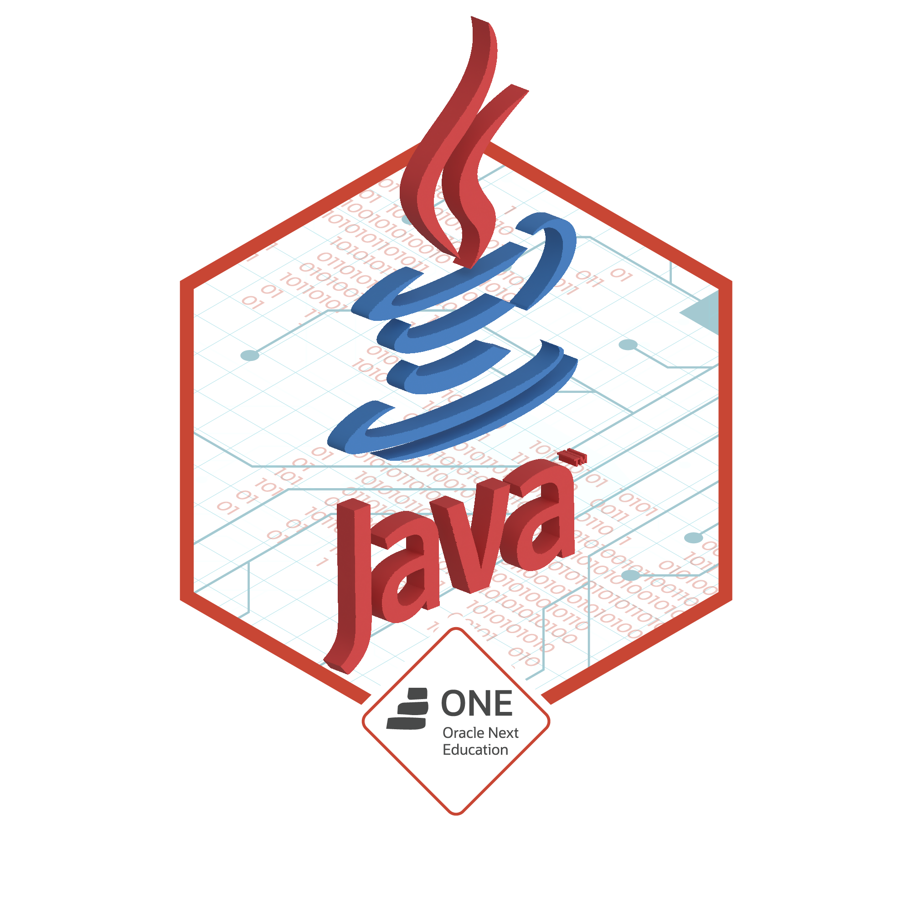

<h1 align="center">Hello there! 👋🏻 I'm Santiago Martínez</h1>

  <strong>Full Stack Developer · Tech Lead · Creative Technologist</strong>

  
  &nbsp;&nbsp;&nbsp;&nbsp;
  
  &nbsp;&nbsp;&nbsp;&nbsp;
  
  &nbsp;&nbsp;&nbsp;&nbsp;
  

## 👨‍💻 About Me

- 🚀 **Full Stack Developer & Tech Lead** with 4+ years of experience building scalable web applications.
- 🅰️ Strong expertise in **Angular**, **TypeScript** and frontend architecture.
- 🌐 Backend experience with **Node.js**, **PostgreSQL**, clean architecture and REST APIs.
- ☁️ Hands-on experience with **GCP**, **Docker**, **Kubernetes** and **CI/CD (CircleCI)**.
- 🧪 Testing-oriented mindset using **Jest, Jasmine, Cypress & SonarQube**.
- 🧠 Interested in **VR/AR**, interactive experiences and immersive technologies.
- 🎨 Background in **3D modeling, graphic design and multimedia**, bridging tech and creativity.

📫 **Contact:**  
📧 santimartz12@gmail.com  
🔗 [LinkedIn](https://www.linkedin.com/in/santimartz)

---

## 🛠️ Tech Stack

**Frontend**
- Angular · TypeScript · RxJS · HTML · CSS · SCSS

**Backend**
- Node.js · PostgreSQL · REST APIs · Clean Architecture

**DevOps & Cloud**
- Google Cloud Platform · Docker · Kubernetes · CircleCI

**Testing**
- Jest · Jasmine · Cypress · SonarQube

**Creative**
- Unity · 3D Modeling · Photoshop · Illustrator · Premiere

---

## 🎓 Oracle ONE – Badges

  
  
  
  
  

  <em>Building scalable systems with a creative mindset.</em>

