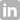

<h1 align='center'>Hello there! 👋🏻 I'm Santiago Martinez</h1>

    
FrontEnd Developer and Graphic Designer

    

    <a target="_blank" href="https://www.linkedin.com/in/santimartz">
    &nbsp;&nbsp;&nbsp;&nbsp;&nbsp;&nbsp;&nbsp;&nbsp;</a>
    <a target="_blank" href="https://www.instagram.com/santimartz12">&nbsp;&nbsp;&nbsp;&nbsp;&nbsp;&nbsp;&nbsp;&nbsp;</a>
    <a target="_blank" href="https://www.artstation.com/santimartz">&nbsp;&nbsp;&nbsp;&nbsp;&nbsp;&nbsp;&nbsp;&nbsp;</a>
    
    

- 👀 I’m interested in OOP and web development
- 🌱 I’m currently learning ReactJS, Angular, Java, and C#
- 💞️ I’m looking to collaborate on Video game development companies
- 📫 You can reach me through my email santimartz12@gmail.com

    

    <h2 align='center'>Oracle ONE - Badges</h2>
    
    
    
    

